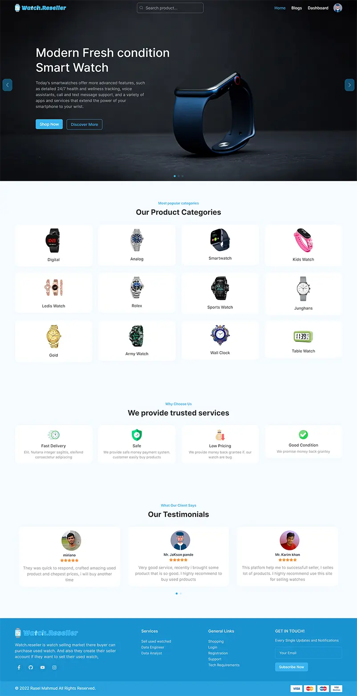

# Watch.Reseller (Client)
## A secondhand product online market

#### Assignment 12

### Github Repo: https://github.com/programming-hero-web-course-4/b612-used-products-resale-clients-side-rasel-mahmud-dev

### Live site: https://watch-reseller.web.app

## Application Features
- Multiple roles base. such as Buyer. Seller, Admin.
- For internation payment system. I use stripe. so buyer can pay with credit card.
- Implement user-friendly all form validator (custom my own).
- buyer can log in via google or email & password. they can recover password if forgot.
- buyer can order, add wishlist, and see their past all transaction.
- Other Side a seller can add/update, delete product. they can manage their product.
- And admin can do anything like she can delete any seller and buyer.
- For security, I use route middle that check user role everytime when they move different route. 
  if they are not permitted then simply them push home or login route
   
  
- And also render dashboard sidebar navigation based on role.

## Work Outline

- In top has a responsible Navigation that has some page link. And condition rendering if user logged then render auth
  image and a dropdown that has dashboard, logout

- Create routing, I use react-router-dom. and create private route with role based like BUYER, SELLER, ADMIN

- We have two authentication system email/password based and google account based.

- Homepage has some product category, and click to jump category products page there has all product that include this category.
- Homepage also have advertises product section that seller mark for advertise. if no one seller mark any product as advertise then this section will be hidden.
- In Dashboard page show auth user profile information, and sidebar show all auth route it dependent user role.

- a public blogs pages has some interview question

## Technology used.

- Reactjs
- react-router-dom
- @tanstack/react-query
- Tailwindcss
- Firebase
- stripe
- react-hot-toast
- react-helmet
- react-spinners
- react-icons
- swiper
- date-fns
- axios

## Preview of HomePage
